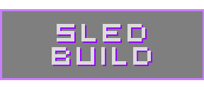

# [SBR] SledBuild Remastered

  

Welcome to **SledBuild Remastered** or (SBR for short). This is a complete rework of the original SledBuild gamemode created by **G3X** back in 2010.

If you are here because you want to play the gamemode, you can subscribe to it on the steam workshop [**here**](https://steamcommunity.com/sharedfiles/filedetails/?id=000000000).

## Discord:
There is an official server for SBR on Discord, where I'd like to create a community for contributing and having fun. You can join it [**here**](https://discord.gg/tCVAAr3ZAU).

## About this project:
SBR was created because I think that this unique gamemode is very fun and interesting to let it die. I also felt like the original implementation was missing some crucial things that could have made the gamemode even better.

So this project aims to do the following key things:
- Implement the original SledBuild but with **more features**.
- Try to keep the gameplay as **competitive as possible**.
- Provide an **open source** base for people to contribute.
- Enable **mapping support** for a wide variety of maps.
- Bring back the fun!

## Mapping:
If you would like to create a map for SBR you can follow [**this guide**](MAPPING_GUIDE) on how to do so. 

## Server:
If you would like to host a server for SBR I will be creating a guide on how to do so soon.

## Contributing:
Pull requests are more than welcome (specially with the UI). For major changes, **please open an issue first** to discuss what you would like to change.

This is my first project ever on LUA, so a lot of things might not follow the best practices and standards. If you see something that could be improved, please let me know.

Also, if you encountered a bug and wan’t to help fix it you can create a new issue, or if it’s a minor thing you can contact me directly on Discord @ **jotalanusse#1337**.

## Credit:
Although SBR is a **complete rework** of the original LUA code, at the beginning a lot of inspiration was taken on how this gamemode was coded (I didn’t know anything and needed a lot of reference). So it’s the right thing to acknowledge the **original contributors**:

- G3X [Coding and Development / Gamemode Concept]
- ReaperSWE [Coding and Development / HUD & GUI Development]
- Borsty [Coding and Development / Mapping]
- Pk191 [Music / SFX]
- BurntFaceMan [Testing]
- Exilion [Testing]
- Aztec [Testing]
- Metroid48 [LUA Help]
- Kylegar [LUA Help]
- robinkooli [Fixing some LUA and make images]
- Meidor [Fixing some LUA]
